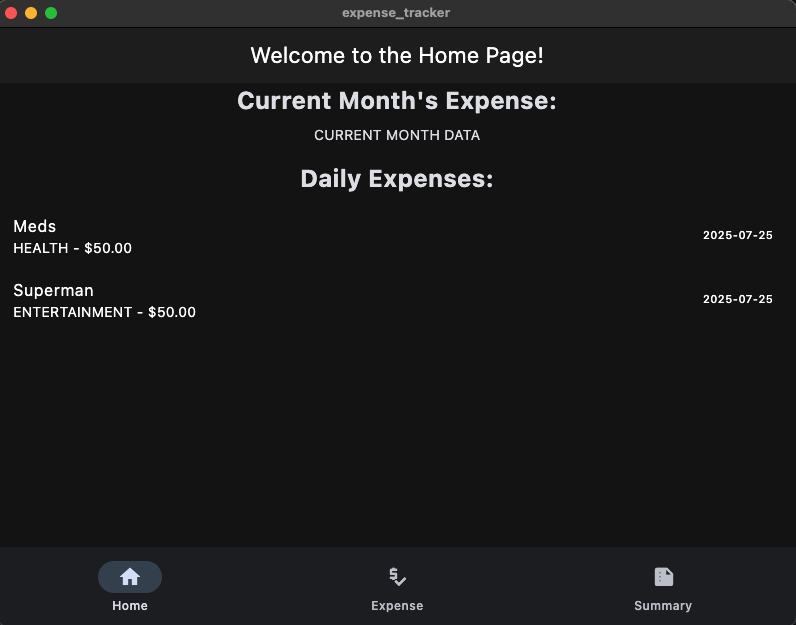
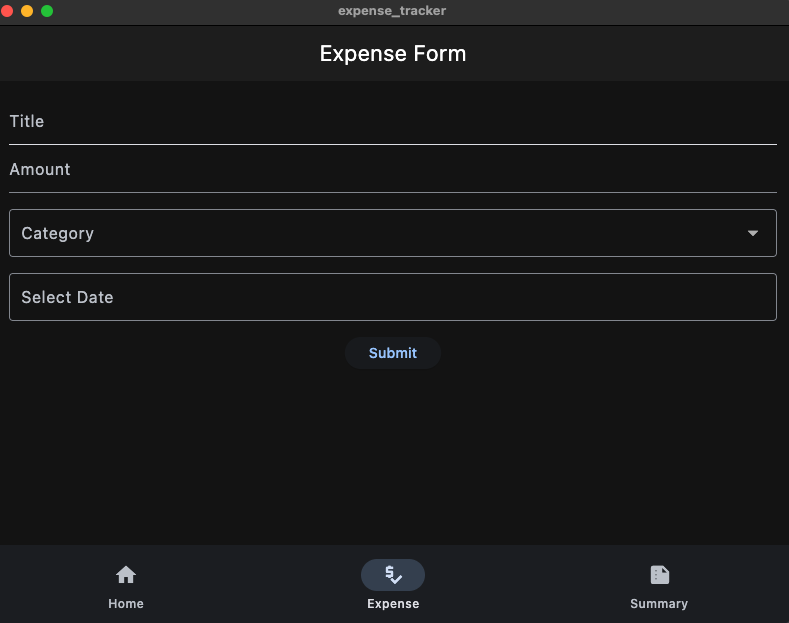
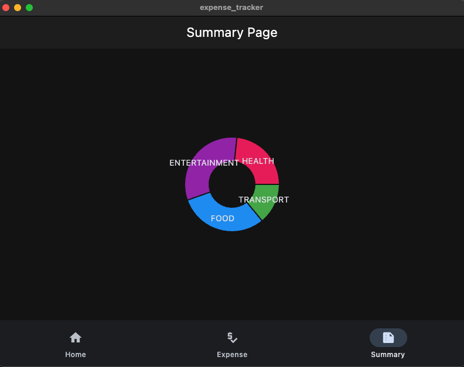
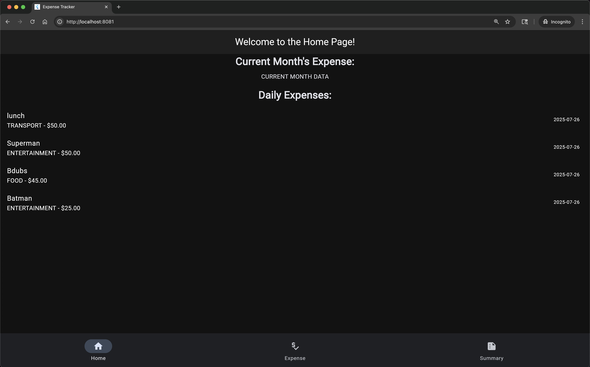
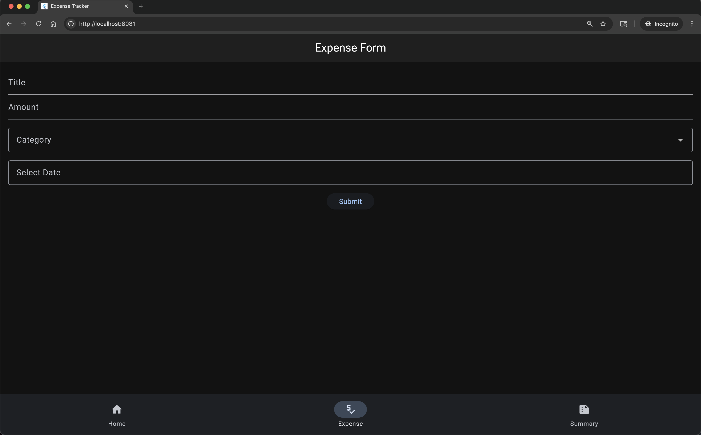
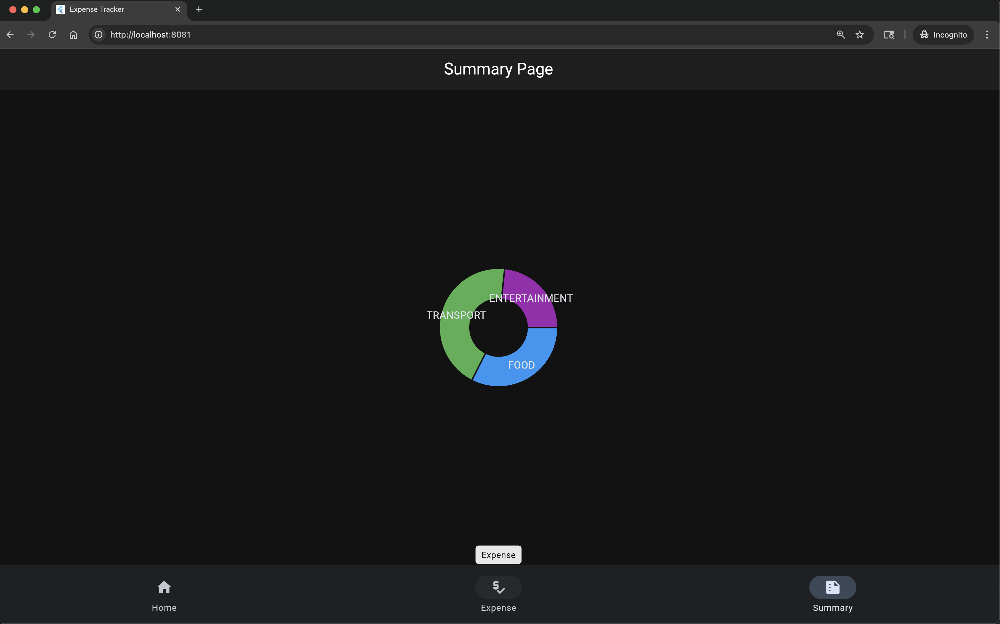

A full-stack expense tracking application built with Flutter frontend and Python gRPC backend, using PostgreSQL for data persistence.

## 📸 Screenshots

Below are screenshots showing the flow of the Expense Tracker app:

## MacOS App

### Home Page



### Expense Form



### Expense Summary



## Chrome Browser from Dockers

### Home Page



### Expense Form



### Expense Summary



## 🏗️ Architecture

- **Frontend**: Flutter (Dart) - Cross-platform mobile and desktop UI
- **Backend**: Python gRPC server - High-performance API service
- **Database**: PostgreSQL - Reliable data storage
- **Communication**: gRPC protocol for efficient client-server communication

## 📁 Project Structure

```
Personal-Expense-Tracker/
├── frontend/                 # Flutter application
│   ├── lib/
│   │   ├── main.dart        # App entry point with auto-server startup
│   │   ├── pages/           # UI screens
│   │   ├── forms/           # Input forms
│   │   ├── services/        # gRPC client services
│   │   └── generated/       # Generated gRPC code
│   └── .vscode/
│       └── launch.json      # VS Code debug configurations
├── backend/
│   └── python/
│       ├── expense_tracker_server.py  # gRPC server
│       ├── database.py      # PostgreSQL connection
│       ├── generated/       # Generated gRPC code
│       ├── requirements.txt # Python dependencies
│       └── venv/           # Virtual environment
├── schema/
│   └── expense.proto       # gRPC service definitions
├── start_app.sh           # Automated startup script
└── AUTO_START_GUIDE.md    # Detailed startup instructions
```

## 🚀 Quick Start

### Prerequisites

1. **PostgreSQL** - Database server

   ```bash
   # Install PostgreSQL (macOS)
   brew install postgresql
   brew services start postgresql
   ```

2. **Python 3.8+** with virtual environment

   ```bash
   python3 --version
   ```

3. **Flutter SDK**
   ```bash
   flutter --version
   ```

### Database Setup

1. Create PostgreSQL database:

   ```sql
   CREATE DATABASE expenses_db;
   CREATE USER expense_user WITH PASSWORD 'your_secure_password';
   GRANT ALL PRIVILEGES ON DATABASE expenses_db TO expense_user;
   ```

2. Verify connection:
   ```bash
   pg_isready -h localhost -p 5432
   ```

### Security Setup

1. Copy the environment template:

   ```bash
   cp .env.example .env
   ```

2. Update `.env` with your actual database credentials:

   ```bash
   # Edit the .env file with your secure password
   DB_PASSWORD=your_secure_password
   ```

   **⚠️ Important**: Never commit the `.env` file to version control!

   For detailed security information, see [SECURITY.md](SECURITY.md).

### Backend Setup

1. Navigate to backend directory:

   ```bash
   cd backend/python
   ```

2. Create and activate virtual environment:

   ```bash
   python3 -m venv venv
   source venv/bin/activate
   ```

3. Install dependencies:
   ```bash
   pip install -r requirements.txt
   ```

### Frontend Setup

1. Navigate to frontend directory:

   ```bash
   cd frontend
   ```

2. Install Flutter dependencies:
   ```bash
   flutter pub get
   ```

## 🎯 Running the Application

### Method 1: Automated Script (Recommended)

```bash
./start_app.sh
```

This script automatically:

- Checks if the backend server is running
- Starts the Python server with virtual environment
- Launches the Flutter frontend
- Handles cleanup on exit

### Method 2: Flutter Auto-Start

```
┌──────────────────┐
│   User/Browser   │
└────────┬─────────┘
         │
         ▼
┌──────────────────┐
│  Flutter Frontend│
│ (flutter run)    │
└────────┬─────────┘
         │   HTTP requests
         ▼
┌──────────────────┐
│   Envoy Proxy    │
│ (envoy.yaml)     │
└────────┬─────────┘
         │   HTTP/gRPC requests
         ▼
┌──────────────────┐
│  Backend Server  │
│ (Python/gRPC or  │
│ HTTP, port 50051)│
└────────┬─────────┘
         │   SQL
         ▼
┌──────────────────┐
│ PostgreSQL DB    │
│ (localhost:5432) │
└──────────────────┘
```

```bash
cd frontend
flutter run
```

The Flutter app automatically starts the backend server before launching the UI.

### Method 3: VS Code Launch Configuration

1. Open project in VS Code
2. Go to Run and Debug (Ctrl/Cmd + Shift + D)
3. Select "Launch Full App (Backend + Frontend)"
4. Click the play button

### Method 4: Manual Start

**Terminal 1 - Backend:**

```bash
cd backend/python
source venv/bin/activate
python3 expense_tracker_server.py
```

**Terminal 2 - Frontend:**

```bash
cd frontend
flutter run
```

## 🐳 Running Backend, Database, and gRPC-Web Proxy with Docker

You can run the backend, PostgreSQL database, **and Envoy gRPC-Web proxy** as containers using Docker Compose for easier setup and browser compatibility.

### Prerequisites

- [Docker Desktop](https://www.docker.com/products/docker-desktop/) installed on your machine.

### Quick Start with Docker Compose

```
                        (User's Browser)
                               │
                               │  (HTTP)
                               ▼
                      ┌────────────────────┐
                      │    Envoy Proxy     │
                      │  (envoy:8080/9901) │
                      └───────┬────────────┘
                      │       │
    (HTTP: API/UI)    │       │  (gRPC/HTTP: 50051)
   ┌──────────────────┘       ▼
   │                 ┌────────────────────┐
   │                 │     Backend        │
   │                 │  (Python:50051)    │
   │                 └────────┬───────────┘
   │                          │
   │                          │ (SQL: 5432)
   │                          ▼
   │                 ┌────────────────────┐
   │                 │   PostgreSQL DB    │
   │                 │  (postgres:5432)   │
   │                 └────────────────────┘
   │
   │ (HTTP: 80)
   ▼
┌────────────────────┐
│     Frontend       │
│   (Nginx:8081/80)  │
└────────────────────┘
```

1. **Build and start the containers:**

   ```bash
   docker-compose up --build
   ```

   This will start:

   - PostgreSQL database (with sample data if `create_expenses_table.sql` is present)
   - Python gRPC backend server
   - Envoy proxy for gRPC-Web (enables browser access to backend)

2. **Access the services:**

   - **Frontend (Flutter web):** [http://localhost:8081](http://localhost:8081)
   - **Envoy gRPC-Web proxy:** [http://localhost:8080](http://localhost:8080)
   - **Backend gRPC server:** `localhost:50051`
   - **Database:** `localhost:5432`

3. **Run the Flutter frontend (web):**

   If using Docker Compose, the frontend is served at [http://localhost:8081](http://localhost:8081).

   If running locally (not in Docker):

   ```bash
   cd frontend
   flutter run -d chrome
   ```

   > The frontend will connect to the backend via Envoy at `http://localhost:8080` using gRPC-Web.

4. **Stopping the containers:**
   ```bash
   docker-compose down
   ```

### Notes

- The Envoy proxy enables browser-based gRPC-Web requests to reach your backend.
- The database container will automatically initialize the schema and sample data if `create_expenses_table.sql` is mounted.
- The backend connects to the database using the environment variables defined in `docker-compose.yml`.
- You can inspect logs with:
  ```bash
  docker-compose logs backend
  docker-compose logs db
  docker-compose logs envoy
  ```

---

## 🕸️ gRPC-Web Architecture

- **Frontend (Flutter Web)** → **Envoy Proxy (gRPC-Web)** → **Backend (Python gRPC)** → **PostgreSQL Database**
- Envoy translates browser gRPC-Web requests to standard gRPC for the backend.

---

## 🔧 Configuration

### Envoy Proxy Configuration

- **Envoy Port**: 8080 (gRPC-Web)
- **Backend Port**: 50051 (gRPC)
- **Frontend Port**: 8081 (Nginx/Flutter web)

See [`envoy.yaml`](envoy.yaml) for proxy setup details.

---

## 🚦 Browser Compatibility

- **Flutter web** uses gRPC-Web via Envoy, allowing browser clients to communicate with the backend securely and efficiently.

---

_Add these sections to your README to document gRPC-Web support and Docker Compose integration for browser-based access._

## 🔧 Configuration

### Server Configuration

- **Backend Port**: 50051 (gRPC)
- **Database**: localhost:5432
- **Host**: localhost

### Environment Variables

The application uses environment variables for secure configuration. All sensitive data is stored in the `.env` file:

```bash
# Database Configuration
DB_NAME=expenses_db
DB_USER=expense_user
DB_PASSWORD=your_secure_password
DB_HOST=localhost
DB_PORT=5432

# gRPC Server Configuration
GRPC_PORT=50051
```

**Security Note**: The `.env` file is automatically excluded from version control. See [SECURITY.md](SECURITY.md) for detailed security guidelines.

## 🛠️ Development

### Generating gRPC Code

If you modify the `schema/expense.proto` file:

**Python:**

```bash
cd backend/python
python -m grpc_tools.protoc --proto_path=../../schema --python_out=generated --grpc_python_out=generated ../../schema/expense.proto
```

**Dart:**

```bash
cd frontend
protoc --dart_out=grpc:lib/generated -I../schema ../schema/expense.proto
```

### Database Schema

The application creates the following table structure:

```sql
CREATE TABLE expenses (
    id SERIAL PRIMARY KEY,
    title VARCHAR(255) NOT NULL,
    amount DECIMAL(10,2) NOT NULL,
    category INTEGER NOT NULL,
    expense_date DATE NOT NULL,
    created_at TIMESTAMP DEFAULT CURRENT_TIMESTAMP
);
```

### Adding Dependencies

**Python:**

```bash
cd backend/python
source venv/bin/activate
pip install package_name
pip freeze > requirements.txt
```

**Flutter:**

```bash
cd frontend
flutter pub add package_name
```

## 🐳 Full Docker Support

You can use Docker Compose to run **every part of the application**—the database, backend, Envoy proxy, and even the Flutter web frontend.  
This means you do **not** need to install Python, PostgreSQL, or Flutter SDK locally; everything runs in containers.

**To start all services (including frontend) with Docker:**

```bash
docker-compose up --build
```

- **Frontend (Flutter web)** is served at [http://localhost:8081](http://localhost:8081)
- **Envoy gRPC-Web proxy** is at [http://localhost:8080](http://localhost:8080)
- **Backend (Python gRPC)** is at `localhost:50051`
- **Database (PostgreSQL)** is at `localhost:5432`

---

## 🌐 Browser Compatibility with gRPC-Web

The application works in your browser thanks to **Envoy's gRPC-Web support**:

- The Flutter web frontend communicates with the backend using gRPC-Web via Envoy.
- This enables efficient, secure, and real-time communication between your browser and the backend.

---

You can develop, test, and use the Expense Tracker entirely in your browser, with all services running in Docker containers and gRPC-Web enabled for seamless frontend-backend integration.

### Logs and Debugging

- **Backend logs**: Check terminal output where server is running
- **Frontend logs**: Check Flutter debug console
- **Database logs**: Check PostgreSQL logs

## 📄 License

This project is licensed under the MIT License - see the LICENSE file for details.
